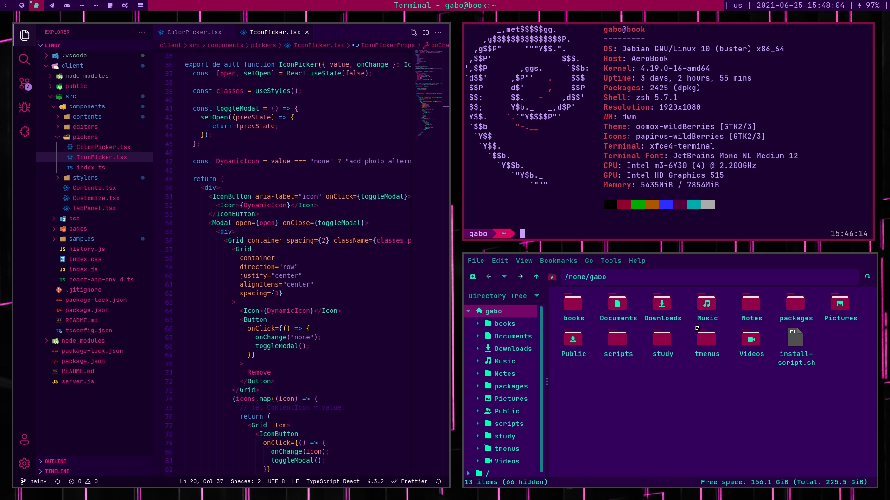

<div align="center">

```
gabo's fork of
      ██╗               `
      ██║               `
████████║ ██╗ ██████████╗
██╔═══██║ ██║ ██╔═██╔═██║
████████████████║ ██║ ██║
╚═══════════════╝ ╚═╝ ╚═╝
dynamic window manager
```

dwm is an extremely fast, small, and dynamic window manager for X.

</div>



## Requirements

In order to build dwm you need the `Xlib` header files.

## ⚙️ Installation

Edit `config.mk` to match your local setup (dwm is installed into
the `/usr/local` namespace by default).
`
Afterwards enter the following command to build and install dwm (if
necessary as root):

```sh
make clean install
```

## 🔄 Running dwm

Add the following line to your .xinitrc to start dwm using startx:

```sh
exec dwm
```

In order to connect dwm to a specific display, make sure that
the DISPLAY environment variable is set correctly, e.g.:

```sh
DISPLAY=foo.bar:1 exec dwm   # This will start dwm on display :1 of the host foo.bar.
```

In order to display status info in the bar, you can do something
like this in your .xinitrc:

```sh
while xsetroot -name "`date` `uptime | sed 's/.*,//'`"
do
    sleep 1
done &
exec dwm
```

## 🔧 Customizing dwm

The customization/configuration of dwm is done by creating a custom `config.h`
and (re)compiling the source code.

<a name="keybinds"></a>

## ⌨️ Current Keybinds

**Keyboard**

- `mod + w`: Spawn terminal
- `mod + b`: Toggle status bar
- `mod + [1-9]`: Switch to tag [1-9]
- `mod + shift + l`: lock screen

`window navigation`

- `mod + shift + [1-9]`: Move client to tag [1-9]
- `mod + [z / x]`: Move focus of window stack
- `mod + shift + [z / x]`: Move position of window stack

`quick menus`

- `mod + d`: Spawn j4-dmenu-desktop (an application menu)
- `mod + shift + d`: Spawn dmenu_tsearch ()
- `mod + shift + 9`: Spawn dial menu ()
- `mod + shift + e`: Spawn focus menu ()
- `mod + shift + tab`: Spawn dmenu_twindow ()
- `mod + shift + p`: Spawn pass menu ()

`media controls`

- `mod + ctrl + [left / right]`: Brigthness control
- `mod + ctrl + [up / down]`: Volume control
- `mod + ???`: Mute volume

`gaps control`

- `mod + alt + [h / l]`: increase/decrease general gaps

- `mod + alt + shift + [h / l]`: increase/decrease outer gaps
- `mod + alt + ctrl + [h / l]`: increase/decrease inner gaps

- `mod + alt + 0`: toggle gaps
- `mod + alt + shift + 0`: set default gaps

- `mod + [y / o]`: increase/decrease horizontal inner gaps
- `mod + alt + [y / o]`: increase/decrease horizontal outer gaps

- `mod + ctrl + [y / o]`: increase/decrease vertical inner gap
- `mod + shift + [y / o]`: increase/decrease vertical outer gap

**Mouse**

- `mod + drag with left click`: Move client
- `mod + drag with right click`: Resize client

## ➕ Current Patches

**Essential stuff**

`alwayscenter`

- makes any new floating window spawn in center of the screen;
- https://dwm.suckless.org/patches/alwayscenter/

`restartsig`

- allow dwm to self restart, without the need of leaving Xorg and calling dwm again;
- https://dwm.suckless.org/patches/restartsig/

**Visual**

`centretitle`

- status bar displays window title at its center;
- https://dwm.suckless.org/patches/centretitle/

`vanitygaps`

- adds gaps for tiling layout;
- there isn't gaps for monocle layout, but the community [finds a way](https://gist.github.com/gbgabo/ef588d7ea043ad5fb60d8369250842b7);
- https://dwm.suckless.org/patches/vanitygaps/

**Utilities**

`focusonnetactive`

- allows dwm to work with `wmctrl -a`, necessary for twindow;
- https://dwm.suckless.org/patches/focusonnetactive/

`push`

- `pushup` and `pushdown` provide a way to move clients inside the clients list;
- https://dwm.suckless.org/patches/push/

## ↗️ Other repositories to check

- [gbgabo/dotfiles](https://github.com/gbgabo/dotfiles): current dotfiles used in my system;
- [gbgabo/dmenu](https://github.com/gbgabo/dmenu): dmenu fork with center patch and own color theme;
- [gbgabo/scripts](https://github.com/gbgabo/scripts): personal scripts for volume control, brightness;
- [TinyTools](https://github.com/TinyToolSH): mainly [tmenu](https://github.com/TinyToolSH/tmenu) and [tsearch](https://github.com/TinyToolSH/tsearch), both used as dmenu wrappers for custom menus and search;
- [gbgabo/wallpapers](https://github.com/gbgabo/wallpapers): dedicated repository for all my wallpapers;
